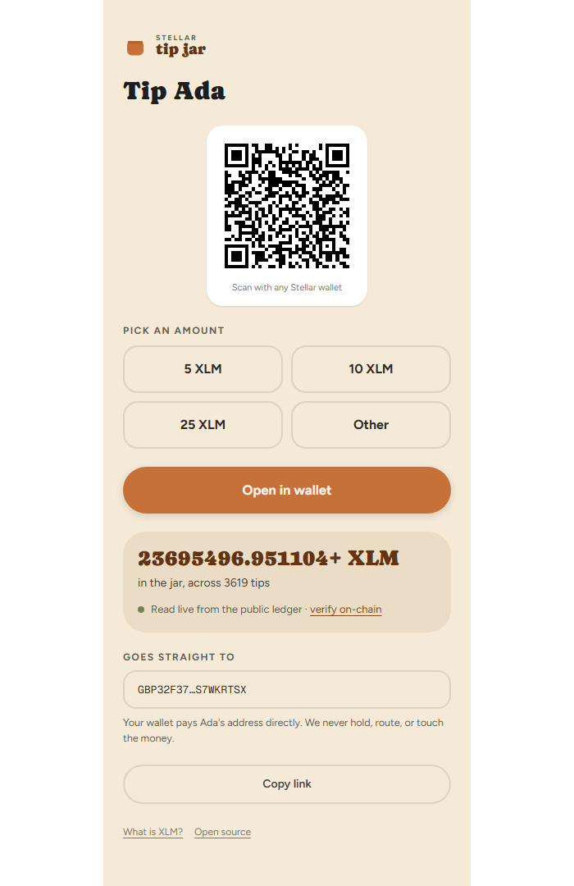

# stellar-tip-jar

[](https://github.com/solaawojobi00-bit/stellar-tip-jar/actions/workflows/ci.yml)
[](LICENSE)

A zero-login, zero-database tip page for Stellar — share one link, receive tips.

**Status:** Phase 1 in progress

A creator dashboard design exists as a forward reference (Claude Design,
https://stellar-tip-jar-phi.vercel.app/) but is not part of the current
build — see [PRD.md](PRD.md) for phasing.

## Setup

```bash
npm install
npm run dev
```

Then open [http://localhost:3000](http://localhost:3000).

A tip page is fully described by its URL:

```
/tip?dest=G...&name=Ada&asset=native&amounts=5,10,25&msg=Thanks!
```



## Scripts

| Command | What it does |
|---|---|
| `npm run dev` | Start the dev server |
| `npm run build` | Production build |
| `npm run lint` | ESLint |
| `npm test` | Vitest (single run) |
| `npm run test:watch` | Vitest in watch mode |

## Docs

- [PRD.md](PRD.md) — problem, goals, requirements, and phasing
- [ARCHITECTURE.md](ARCHITECTURE.md) — modules, data flow, and non-goals

## License

[MIT](LICENSE)
